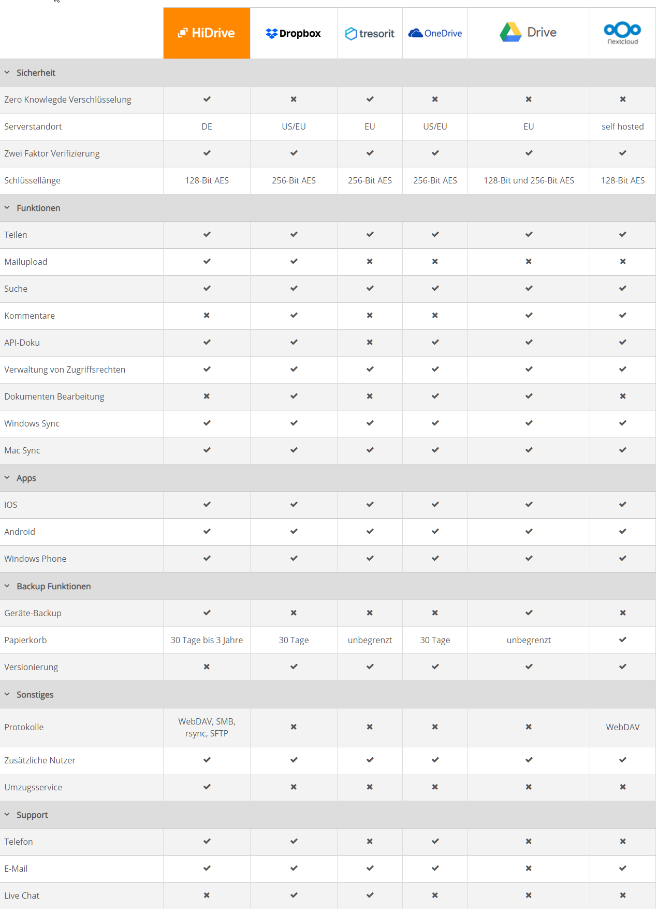

# [Serwery .de](https://www.serwery.de/)

Opracowanie zawiera aktualne oferty na rok 2021.

## Status opracowania

Opracowanie jest w trakcie tworzenia (aktualizacja co kwartał)

## Oferty niemieckich providerów:
  + domen
  + serwerów wirtualnych VPS na wirtualizacji KVM
  + serwerów dedykowanych
  + usług Cloud

# Lista operatorów:

+ [IONOS by 1&1 - Ihre Marke für Mail, Domain & Website](https://www.ionos.de)
+ [STRATO - Gedacht. Gemacht.](https://www.strato.de/)
+ [netcup GmbH - Ihr Partner fuer Webhosting, vServer, Server, managed Server, Domains](https://www.netcup.de/)
+ [Contabo 🥇 Starke VPS & Dedicated Server zu unglaublichen Preisen 🥇](https://contabo.com/de/)
+ [Domain Name Search - HEXONET](https://www.hexonet.net/)

# Oferty usług

## Domeny Internetowe
+ hexonet.net
+ strato.de
+ 

## VPS

## Cloud

# Backup Service/Software
https://www.strato.de/cloud-speicher/cloud-speicher-vergleich/

